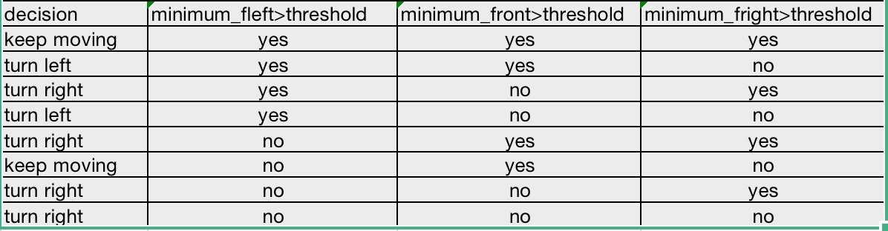

# RT assignment 2nd
    by Zhouyang Hong 
    sid: 5197402
    
## how to use
  ### Here, compiles those nodes
    1. enter the directory of your ROS-workspace
    2. run: cd src
    3. run: git clone $(url of this directory)
    4. run: cd ..
    5. run catkin_make on  ROS-workspace to build those nodes
    *************************************************************
   ### Now we are going to run those generated ros-nodes, put cmmoands below on your terminal
    1. roscore
    2. rosrun stage_ros stageros $(rospack find second_assignment)/world/my_world.world &
    3. rosrun ass_2 controller
    #### open another window
    4. rosrun ass_2 user_interact
   ### Now you can control the robot on "user_interface" window by inputting the following commands:
        1. w
        2. s
        3. r
    1. When you press 'w'+"return",the robot will increase its speed by 10%. 
    2. In the meanwhile 's'+"return" will decrease the speed by 10%. 
    3. you can press 'r'+"return" to put the robot to its initial position.
    
    
## Structure of controller.cpp
   ### devide the base_scan data into 180 pieces and choose 3 ranges and take the minimum
        Here, I divided the data into 180 pieces to simulate a 180 degree angle. Then it will be ease to choose the specific angle range that I desired. Finally I chose a range set of 36->72, 85->95 and 108->144.
        The pseudo code for choosing them is:
while: index<720
    if 36*4<=index<72*4
            if ranges[index] < minimum_fleft
                    minimum_fleft = ranges[index]
    if 85*4<=index<95*4
            if ranges[index] < minimum_front
                    minimum_front = ranges[index]
    if 36*4<=index<72*4
            if ranges[index] < minimum_fright
                    minimum_fright = ranges[index]
Now, minimum_fleft,minimum_front,minimum_fright stores the nearest object in those three directions.

   ### Driving decision making    
By comparing the above minimum distances from three directions with a threshold, and the connections of comparison results. the robot is able to decide turn left, turn right or keep moving. The table below shows the connections.

   ### speed control
In order to control the speed of robot, there is a global variable which works as a coefficient of both linear and rotational speed. When this service-node received the changing-speed-command request, inside the service callback-function just change the value of the global variable so as to change the speed.

## Structure of user_interface.cpp
   ### introduction
   This node consists of two service clients. One is for telling controller to change the speed and another is for resetting the position of robot. In the code structure, It constantly waiting for a key input and decide what do to. 
   'w' is for increasing the speed by 10 percent
   's' is for decreasing the speed by 10 percent
   'r' is for placing the robot at the initial point
   
   ### pseudo code

while true:
    cmmd = get_a_key()
    if cmmd == 'w'
            send 'w' to speed_control service
    if cmmd == 's'
            send 's' to speed_control service
    if cmmd == 'r'
            call reset_positions service
            
    